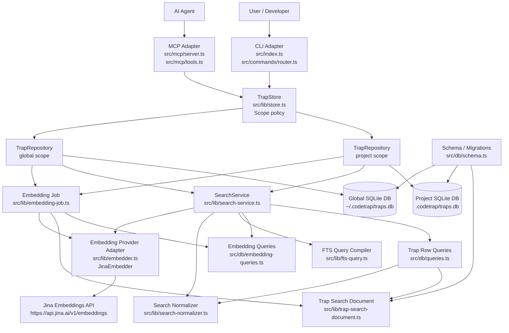
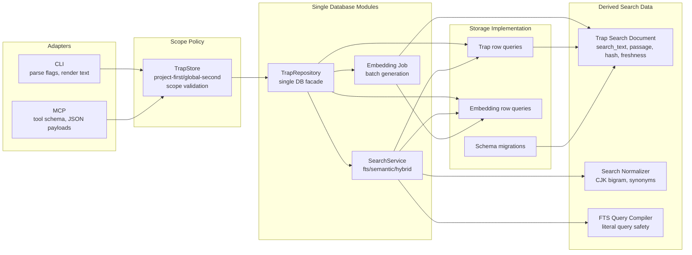
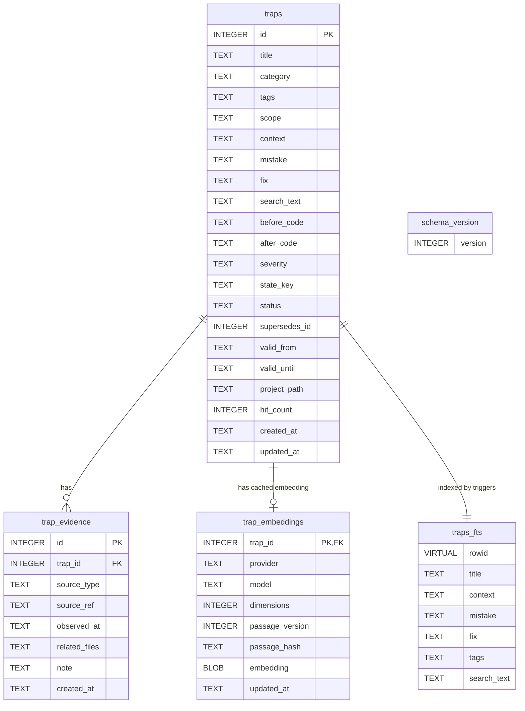
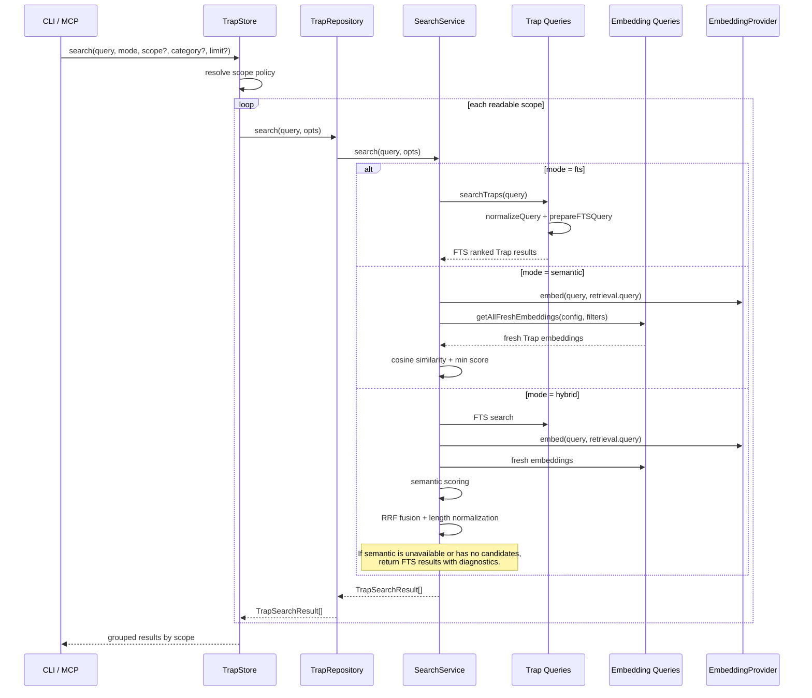
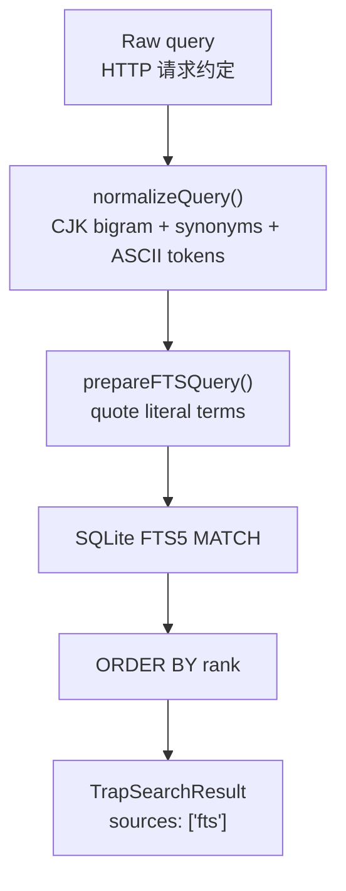
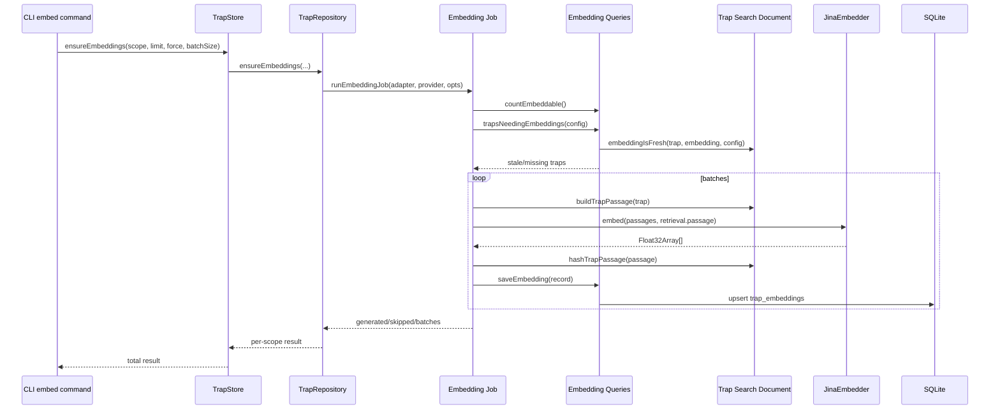
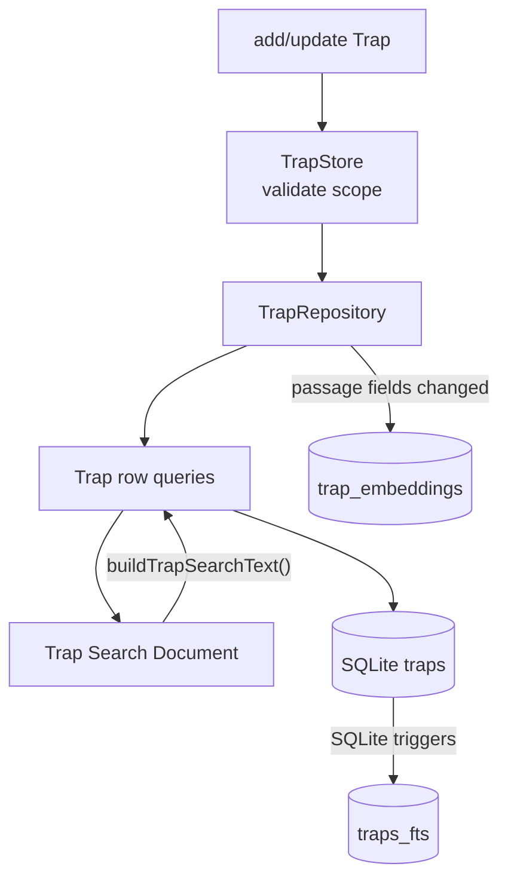
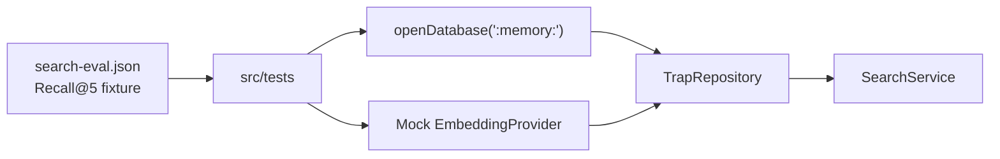
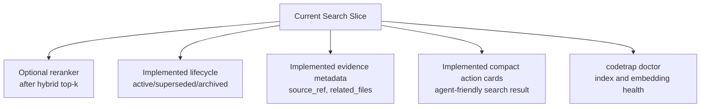

# codetrap Architecture

本文描述 codetrap 当前架构：Trap 的存储、Scope policy、CLI/MCP adapters、FTS/semantic/hybrid search、embedding 缓存和测试结构。

## System Overview



## Module Responsibilities



Key locality rules:

- `TrapStore` owns Scope policy. It decides whether reads go project-first/global-second or only to an explicit scope.
- `TrapOperations` owns shared Trap command execution semantics for CLI and MCP adapters.
- `trap-archive.ts` owns archive import/export compatibility, including evidence remapping.
- `trap-json-fields.ts` owns JSON string-array conversion for `tags` and `related_files`.
- `TrapRepository` owns one SQLite database. It does not know where project/global roots come from.
- `SearchService` owns retrieval and ranking inside one database.
- `trap-search-document.ts` owns derived Trap search data: `search_text`, embedding passage, passage hash, and freshness rules.
- `search-result-card.ts` owns compact action-card shape for agent-facing search results.
- CLI and MCP are adapters. They should not implement search, ranking, embedding, or schema rules.

## Storage Model



Storage notes:

- `traps` is canonical Trap storage.
- `trap_evidence` stores drill-down source metadata and is not loaded by default search.
- `traps_fts` is an FTS5 virtual table synchronized by SQLite triggers.
- `search_text` is derived from Trap fields for CJK bigram and synonym-expanded lexical search.
- `trap_embeddings` is a rebuildable cache. Freshness is determined by provider/model/dimensions/passage_version/passage_hash.
- `schema_version` controls migrations. Current schema version is `4`.
- Version 4 adds trap lifecycle metadata (`status`, `state_key`, `supersedes_id`, `valid_from`, `valid_until`) and `trap_evidence`.

## Search Flow



Search modes:

- `fts`: SQLite FTS5 with safe literal query compilation.
- `semantic`: query embedding + brute-force cosine similarity over fresh embeddings.
- `hybrid`: FTS + semantic + RRF fusion. Falls back to FTS with diagnostics when semantic is unavailable.

## FTS Search Detail



Safety rule:

- User text is treated as literal text by default.
- FTS operators such as `AND`, `OR`, `NOT`, and `NEAR` are not exposed through the default interface.
- Special characters like `*`, `(`, `)`, `/`, `-`, `"`, and `~` should not crash search.

## Embedding Generation Flow



Embedding cache rules:

- Embeddings are generated explicitly by `codetrap embed`.
- `hybrid` search uses existing fresh embeddings if available.
- `hybrid` search falls back to FTS if no provider/key/fresh embeddings are available.
- `semantic` search requires a provider and fresh embeddings.
- Updating passage-related Trap fields invalidates the cached embedding.

## Write Flow



Write invariants:

- Every Trap row has a derived `search_text`.
- SQLite triggers keep `traps_fts` synchronized with `traps`.
- If a Trap field that contributes to embedding passage changes, the cached embedding is deleted.
- Fresh embeddings can be regenerated later with `codetrap embed`.

## Test Architecture



Test coverage:

- FTS safety and literal query compilation.
- CLI argument parsing.
- CJK bigram and synonym normalization.
- Chinese/mixed-language search.
- Semantic search with mock embeddings.
- Hybrid fallback diagnostics.
- Embedding generation batching.
- Embedding invalidation after Trap updates.
- Recall@5 eval fixture across lexical, Chinese, semantic, and oblique queries.

## Key Commands

```bash
# typecheck
bunx tsc --noEmit

# tests
bun test src/tests/

# build standalone binaries
bun run build

# generate embeddings for project scope
bun run src/index.ts embed --scope project

# hybrid search
bun run src/index.ts search "HTTP 请求约定" --mode hybrid
```

## Current Extension Points



Implemented modules:

- `search-result-card.ts`: compact action cards for MCP/agent consumption.
- Trap lifecycle fields: `state_key`, `status`, `supersedes_id`, `valid_from`, `valid_until`.
- Evidence/source metadata for traceable Trap origin.

Likely next modules:

- `codetrap doctor` for FTS index and embedding cache health.
