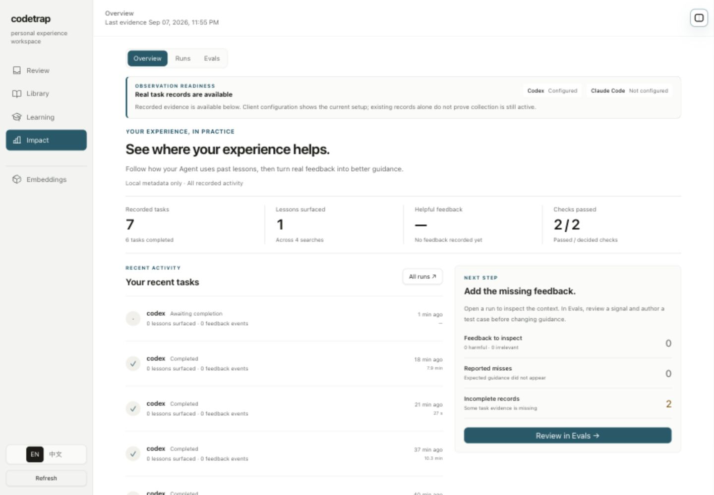
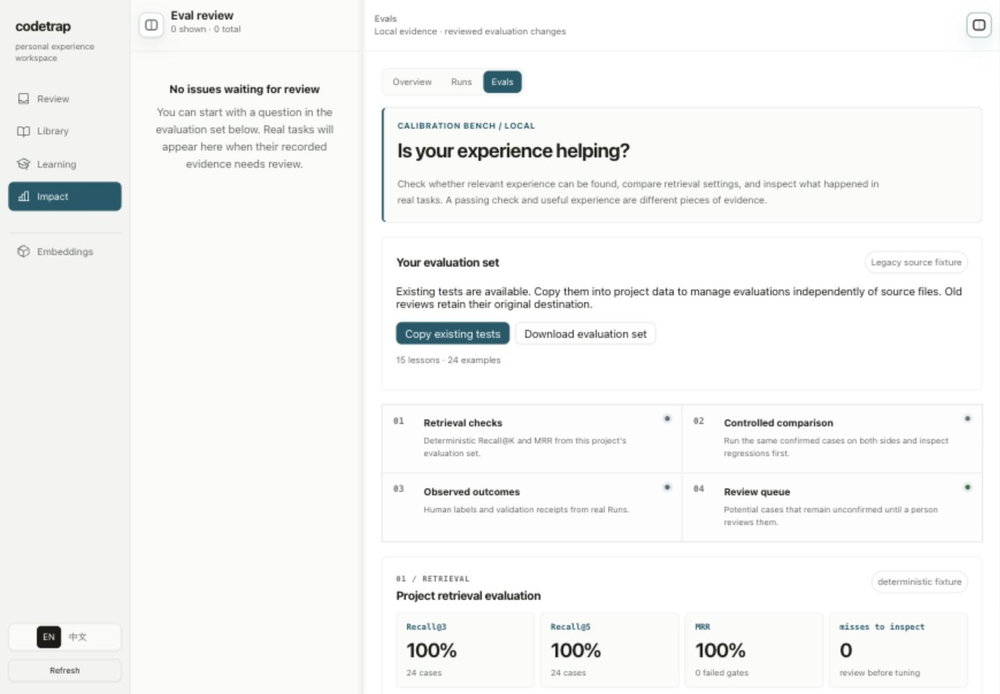
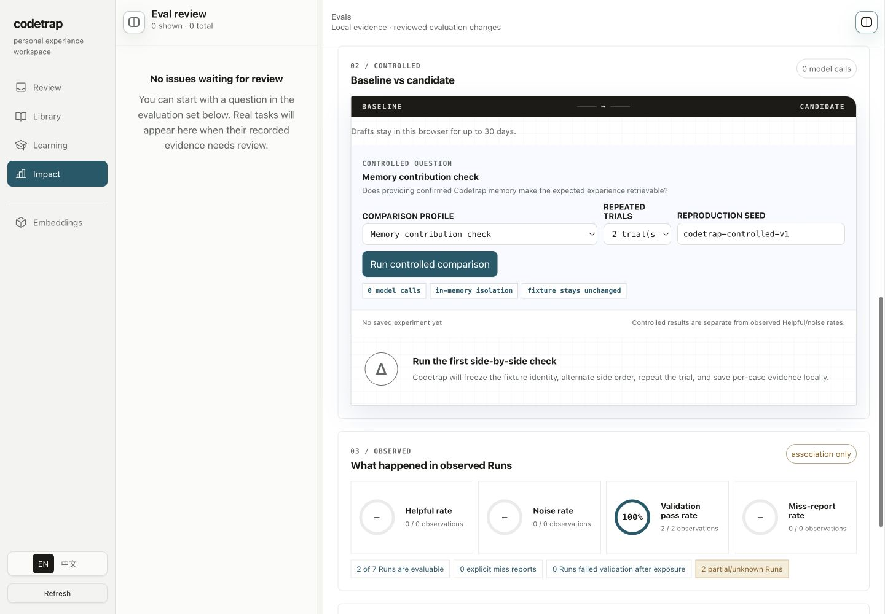
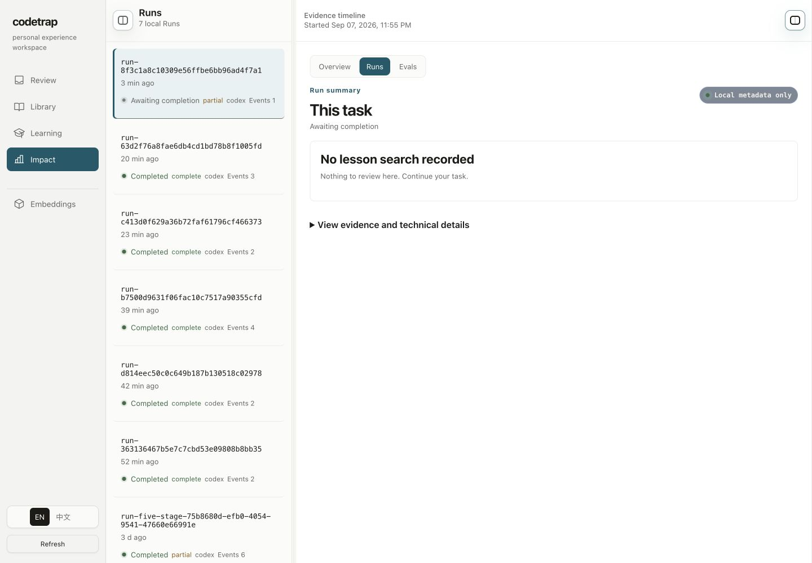
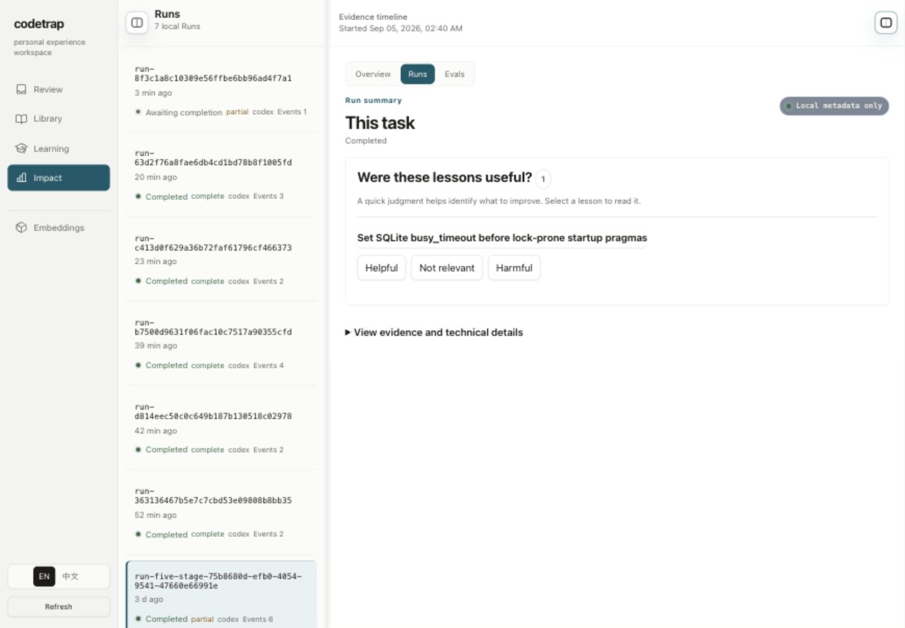
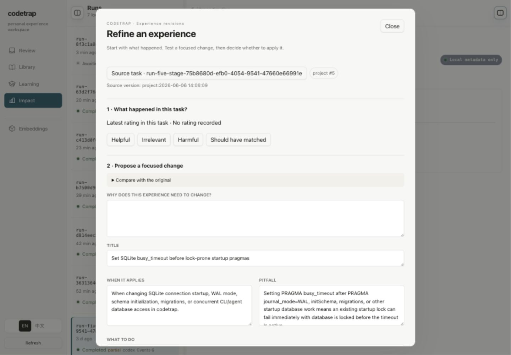
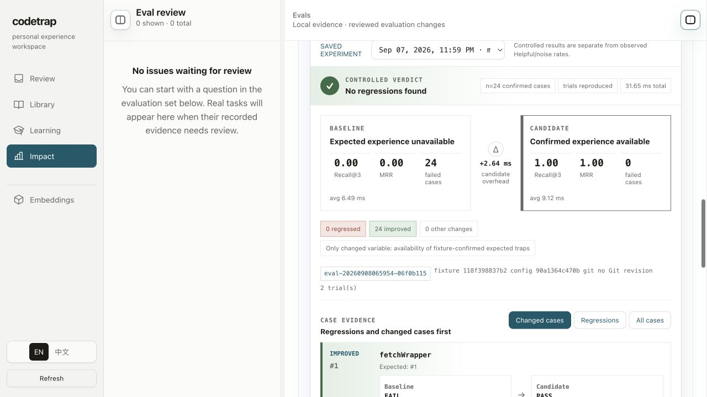
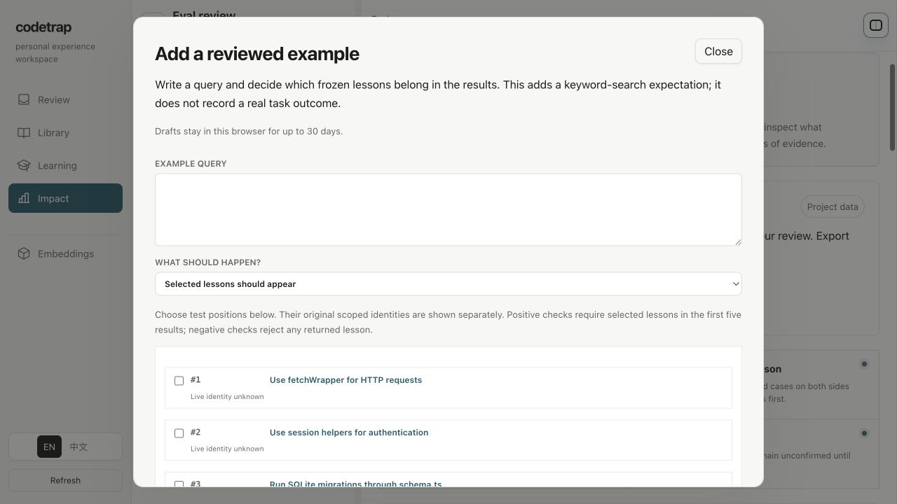
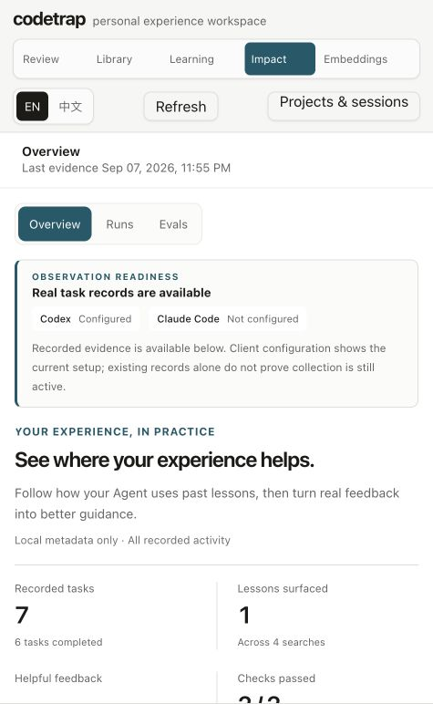

# Codetrap 评测与观测体验审查

审查开始于 2026-09-07，完成于 2026-09-08，时区 America/Los_Angeles。

本轮查看当前工作区源码、实际本地项目页面，以及隔离目录内复制现有 fixture 后得到的确定性实验结果。已有未提交的 Run evidence lineage 修改纳入分析。本报告是优化提案，没有修改产品实现、经验内容或人为添加真实任务反馈。

## Status Dashboard

- Done（2026-09-08）：[整个 Impact 正式迁移](../../tasks/2026-09-08-impact-production-migration/handoff.md)，已用确认原型整体替换正式界面并接入真实数据、反馈、修订、验证、应用与回滚。以下正文及截图保留为改版前审查依据。

- Done（2026-09-08）：[评测工作台第一轮实现与验证](../../tasks/2026-09-08-evals-workbench/handoff.md)。已完成结果与操作重排、覆盖范围披露、案例表格、冻结快照标题及总览反馈入口。58 项相关测试通过，桌面与窄屏截图见实施档案。
- Deferred: 真实 embedding / Agent 配对试验、跨版本趋势及大规模索引。原始截图与审查结论保留作为改版前证据。

## 审查结论

当前界面把已有技术能力逐块展示出来，但没有充分帮助用户做决定：这次应该检查哪条经验、问题发生在哪里、怎样验证修改、修改之后有没有再次出错。视觉上的不满意主要来自信息层级和任务组织，换颜色、加图表不足以解决。

建议把成效区域组织成一个围绕经验改进的工作台。默认突出待处理问题和最近验证结果；评测页突出案例对照；运行详情提供足够的任务与检索上下文，再让用户反馈。保留当前本地优先、明确人工判断、精确版本审核和回滚能力。

尤其需要校准评测表达。当前项目的 100% 来自 24 条固定正例，语义模式使用测试向量，并不能说明实际 embedding 或真实编码效果已经达到 100%。

## 实际走过的用户路径

### 1. 进入成效总览

可取之处：未记录反馈显示为“—”，通过检查显示 2/2，避免直接把缺失当作 0；采集配置与已有记录分开说明。

问题：本次页面有 7 个 Run、4 次搜索、1 次经验曝光、0 条有用性反馈。主文案仍是泛化的价值介绍；“Add the missing feedback”下面的主按钮却把用户送到没有候选的 Evals。最近任务主要显示 codex 和状态，用户难以辨认任务。接入说明在已有数据时仍占据显著高度。

建议：接入状态正常时压成一行；首屏显示证据缺口和可直接执行的动作。例如本次数据可以表达为“已记录 7 次任务，1 次经验展示尚无反馈”，主动作直接打开对应 Run。没有足够数据时呈现“尚不能判断效果”和下一条可采集证据。

### 2. 打开 Evals 首屏

可取之处：项目集合来源可见；集合建立、导出、受控实验、真实观测和人工校准都已有入口。

问题：约 330px 的空审核栏始终占位；右侧连续出现介绍、集合迁移、四块证据类型说明，滚动后才能真正操作对照。左侧审核队列与页面底部审核区重复。四个模块看上去同等重要，没有依据用户当前状态选择主任务。

建议：Evals 使用完整内容宽度；待审核问题放到独立子视图或按需展开的抽屉。首屏顺序为：当前集合与版本、最新实验结论、主要动作、案例对照。集合迁移/导出归入“管理集合”；四块说明放入帮助。保留必要的证据类型标签，但不反复铺满解释文本。

### 3. 配置对照并理解分数

问题：用户首先要理解 comparison profile、trial、seed、baseline、candidate。表单旁反复出现零调用、内存隔离、fixture 不变等实现说明。真实 Run 的 2/2 检查通过率与离线检索 100% 出现在同一长页面，即使有说明，仍增加混淆机会。

建议：主问题改成“这次要验证什么”，优先支持“修改某条经验之后是否减少误报/漏召回”“调整检索策略之后是否出现回归”。选定目标和集合即可运行；seed、重复次数、引擎信息在高级设置。执行前清晰标记本次是规则回归、真实检索回放还是 Agent 任务实验。

### 4. 进入 Run 并找到经验

问题：列表是长 Run ID、状态和事件数；详情标题为“This task”。大量正常但缺少搜索的记录把有反馈价值的任务埋在下面。当前 API 也没有可直接使用的任务标题，所以无法只靠前端美化解决。

可取之处：现有新实现已把 Helpful / Not relevant / Harmful 放到经验旁，技术详情可折叠，方向正确。

问题：用户还没看到任务摘要、触发搜索或当时版本的经验内容，就被要求做判断。点击“阅读经验”的标题实际打开了完整修订表单，阅读与修改的操作预期不一致。

建议：先展示“任务摘要（如有）→ 触发的搜索/适用范围（如有）→ 展示的经验版本 → 检查结果”，再给快捷判断。标题打开只读详情，独立按钮“改进这条经验”进入修订。没有正文时明确说明未保存，并提供补充本地上下文的入口，不从 fingerprint 猜原文。任务标题可由调用方显式提供或用户本地命名；历史数据保持未知。

### 5. 从反馈转入修订

可取之处：当前流程已经有反馈、修改原因、经验字段、正反例、保存测试和应用操作；不是缺少整个改进后端。

问题：一个“看看这条经验”的点击，展开长表单并同时要求完成三个认知任务。原内容被折叠，编辑区域却先出现。任务来源仍显示长 ID。用户不知道反馈本身已完成，还是必须填完整张表才算完成。

建议：保留一步快捷反馈；反馈成功后显示“已记录”，再可选进入“改进经验”。修订采用三个连续步骤：确认问题和目标、编辑差异、查看正反例及回归结果。固定底部主要动作，明确保存中/已保存/需要重新测试/已应用。重用现有 digest、版本校验和回滚，不另建批准路径。

### 6. 阅读实验结果（隔离副本）

这张图来自临时项目，使用当前仓库 fixture 的复制件执行，没有写入用户项目实验历史。

可取之处：已有两侧指标、变化分类、实验身份、集合快照和逐案例结果。结果不是假数据。

问题：最显眼的两侧差值是几毫秒耗时，用户最关心的哪些问题修好了、哪些变差了被放到下面。逐案例每条都是多层卡片，不方便跨案例扫描；后端保留 top 5，前端只展示各侧第一条标题。期望经验只有 fixture 数字 ID，原始文件路径不能替代可点击的证据详情。

建议：首行显示“新增通过、回归、仍失败、未变化”的计数；主体用可筛选的对照表，列为问题/期望经验/修改前/修改后/变化。点开案例抽屉查看完整 top 5、排名变化、适用范围和来源。耗时放入次级列；不把小样本毫秒差渲染成主要收益。

### 7. 新建样例（隔离副本，仅打开）

问题：先看大量内部概念说明，再在长列表中寻找经验；当前列表没有搜索。15 条已经较长，集合支持更多经验时会放大选择成本。原来源未知标识有必要，但可以作为次级信息。

建议：从问题/Run/经验进入时带上可确认的上下文和目标；通用入口提供经验搜索与范围筛选。显式区分“目标经验不该出现”和“所有经验都不该出现”，当前修订反例与集合负例的判断范围不同，不能用一份模糊文案隐藏。

## 评测现在到底能证明什么

源码依据：`src/lib/search-eval.ts:99` 和 `:537`；`src/lib/controlled-eval.ts:232` 和 `:451`；`src/lib/experience-revisions.ts:140`。

本次现有集合含 15 条经验、24 条查询：6 条 FTS、13 条 hybrid、5 条 semantic，全部是正例，负例为 0。详细隔离运行记录见 [isolated-check-results.json](isolated-check-results.json)。

| 检查 | 本次结果 | 可以支持的结论 | 不能据此得出的结论 |
|---|---|---|---|
| 项目检索摘要 | Recall@3、Recall@5、MRR 均 100% | 固定查询在当前确定性测试条件下通过 | 实际任务中没有漏召回或噪声 |
| retrieval_policy_v1 | 两侧均 100%；13 条结果变化，0 回归、0 从失败变通过 | 当前样例下排序有变化，门槛未下降 | 真实 embedding 或 hybrid 已优于 FTS |
| memory_contribution_v1 | 基线 24 条失败，候选 24 条通过 | 移除预期内容会破坏这批样例的可检索性 | Agent 编码成功率提升 100% |
| 单条经验修订测试 | 后端使用冻结语料和 FTS，要求正负例 | 目标经验在这些关键词条件下应出现/不出现 | 全项目检索不回归、语义检索有效或真实任务行为已改善 |

`EvalEmbedder` 是 14 维关键词规则向量；适合作为稳定测试替身。`memory_contribution_v1` 的基线把整个集合中 goldTrapIds 对应内容替换为占位经验，候选侧使用完整 fixture。这是内容消融，并非真实 Agent 开关记忆的实验。

反复执行确定性案例主要验证可复现和运行顺序影响，不增加独立任务样本量。应显示“24 个独立案例，重复 2 次”，避免把重复次数解读为 48 个独立样本。

建议明确三种能力，并把当前实现准确放入第一种：

1. **规则回归检查**：本地、可复现，FTS/测试替身；验证实现和人工预期。
2. **真实检索回放**：冻结语料和查询，用真实 provider/model、排名配置和索引状态比较修改前后。显示降级、索引覆盖和失败；需要调用远程 provider 时沿用项目的显式配置与数据边界。
3. **Agent 任务实验**：未来阶段，以相同代码基线、任务、模型和工具条件，对照经验版本或有无记忆；看测试、重复踩坑、人工纠正及成本。该层当前尚未实现。

现有集合应补充经过人审核的负例、近似但不相关的查询、范围不匹配、经验过期/替代、中英混合表达。新增困难样例应与调参样例区分，可保留独立回归集；不能依赖为现有案例定制的测试向量推断泛化。

## 观测能否推动 Codetrap 改善

能，当前已经具备大部分基础组件，但用户需要一个连续的处理过程。

已经存在：Observation Ledger、候选按问题聚合、人工反馈折叠去重、受治理的评测候选、经验修订正反例测试、精确版本应用和回滚、新版本后续 Run 关联。应复用这些实现。

尚不足：聚合入口没有把来源问题、修订、评测结果、上线后的使用情况串成一条可追踪记录；通用受控 Evals 与单条经验修订测试相互分散；对后续效果的读取只提供最多 20 个匹配版本的 Run，不能视为总体效果率。

问题类型必须决定修复入口：

| 用户反馈/证据 | 需要进一步判断 | 默认下一步 |
|---|---|---|
| 应该提示却没有提示 | 内容不存在、召回失败、范围过滤、索引降级 | 补充可复现查询和预期经验，先诊断检索；内容缺失才新增经验 |
| 提示不相关 | 适用范围太广、排序错误、任务条件不同 | 添加排除样例；调整范围或检索策略 |
| 经验过期或错误 | 事实内容及版本是否需要修改 | 经验修订与相关样例复测 |
| 有命中但任务仍失败 | 是否被采用、失败是否与经验有关 | 检查执行/验证证据；不自动认定经验有害 |
| 没有足够证据 | 未搜索、未反馈、事件不完整 | 补证据或改善接入；不生成虚假的质量结论 |

建议提供一个统一的问题读取视图，关联已有实体：`issue → source_run/event → scoped_lesson/revision → reviewed_case/suite_version → experiment → applied_revision → subsequent_evidence`。它先作为现有记录的聚合投影，不替换当前审核存储和写入合同。

用户可见状态为“待判断、修改中、待验证、已应用待观察、已解决、已忽略”。测试通过进入“待应用”，应用之后仍是“待观察”；后续使用与反馈单独记录。不要仅因被再次检索到就自动标记已解决。

## 建议的信息架构与界面规格

保留 Impact 入口，在内部整理为“总览 / 运行 / 评测 / 改进”。改进队列集中处理证据问题；现有 Review 继续负责授权与审核结果，通过深链接连接。

| 页面 | 默认回答的问题 | 主要内容与动作 |
|---|---|---|
| 总览 | 我现在应关注什么？ | 证据覆盖、待处理问题、最近验证；直接到有价值的 Run 或修订 |
| 运行 | 当时发生了什么？ | 任务摘要、检索与经验版本、验证、快捷反馈；技术时间线按需展开 |
| 评测 | 这次修改有没有变好？ | 最新实验、版本对照、案例矩阵；管理集合放次级入口 |
| 改进 | 这条问题处理到哪一步？ | 聚合问题、发生次数、最近出现、修订状态、验证与后续效果 |

Evals 首屏示意顺序（建议，不是已实现界面）：项目与集合版本 → 本次比较目标/两侧版本 → 回归/新增通过/仍失败计数 → 案例表 → 案例详情抽屉。空状态使用一个主动作：准备集合或从真实问题添加样例；已有集合时优先运行比较；已有实验时优先检查变化。

视觉细节沿用现有中性色和青色强调色。减少嵌套边框、重复 pill、大段介绍和装饰性网格；正文建议 14–16px，元数据 12–13px，统一数值格式。颜色用于状态，配合文字，不把颜色作为唯一线索。列表采用适中的行高，保持标题和操作对齐，长 ID 收入详情并提供复制。

在窄屏中先显示摘要与案例列表，点击进入单案例对照；桌面显示并排表格与抽屉。不要把桌面三栏横向挤压到窄屏。抽屉和长表单需检查焦点锁定、Escape 返回、回到原行、滚动位置恢复和固定操作栏。

## 前后端落地顺序

以下是建议优先级，不是已实施变更或工期承诺。

| 顺序 | 前端 | 后端/数据 | 验收方式 |
|---|---|---|---|
| P0：校准评测含义 | 显示“规则回归/测试向量”、真实案例数、正负例覆盖；明确缺失数据 | 返回 evaluator kind、embedding mode、正负例数量、适用边界 | 24 条正例不得呈现成真实任务改善率；零反馈保持未知 |
| P0：重排首屏 | 空队列收起、结果提前、管理及高级配置折叠；按状态决定主动作 | 尽量复用已有 payload，补齐集合覆盖摘要 | 进入评测后一屏能找到比较目标和下一步；Overview 缺反馈时直达可反馈 Run |
| P1：案例对照与诊断 | 表格、回归筛选、期望标题、完整 top 5 抽屉、来源跳转 | 实验摘要与案例详情分离；保存 ranked refs、配置身份和可用诊断 | 可解释某条案例为何变化；查看案例不丢列表位置 |
| P1：连接已有修订流程 | 快捷反馈与修订分开；统一问题进度和深链接 | 聚合现有候选、修订、测试和 Run；保留审批/幂等/回滚 | 一个真实问题能追踪到被测修改与应用版本；中途返回不丢草稿 |
| P1：真实检索回放 | 明确选 provider/profile，展示索引覆盖和降级 | 新增实际检索 evaluator；固定语料、查询、配置、模型身份 | 比较只改变声明的变量；失败/降级不可伪装成成功比较 |
| P2：规模与后续效果 | 服务端筛选分页、趋势与样本数、版本过滤 | 读投影索引、缓存键、历史分页；版本后续结果聚合 | 可找回较早实验/Run；更正反馈不会重复计数；缺失不混入分母 |
| P3：Agent 任务实验 | 任务级结果、成本、验证失败原因 | 隔离工作目录、预算、超时、试次与任务基线 | 相同任务与代码基线对照，可回放失败，不用检索分数替代任务结果 |

### 对当前模块的具体影响

- `src/web/client-impact.ts:518`：将 Evals 大模板按状态、摘要、表格、案例详情拆开。`renderControlledCase` 当前只取 `top_results[0]`，已有数据可以先支持更多证据。此重排不要求更换前端框架。
- `src/web/client-impact-overview.ts:30`：动作目标应根据证据类型和是否有数据决定，而不是统一指向 Evals；列表增加可识别任务摘要需要后端支持。
- `src/web/client-run-evidence.ts` / `client-revisions.ts`：保留快速反馈、草稿和精确测试约束，分离“阅读”和“编辑”的入口。
- `src/web/evals-view.ts:94`：当前每次组装 Evals payload 会计算检索摘要并读取实验历史，同时返回多类完整数据。按 suite SHA + evaluator/config identity 缓存离线结果；摘要、实验列表、案例详情、队列独立读取。现有 Observation Ledger 缓存继续使用。
- `src/lib/controlled-eval.ts:210`：历史虽然默认只返回 12 条，读取时仍遍历并解析所有 JSON，返回的实验也包含 cases。后续采用带游标的摘要索引，详情按 ID 读取；保留不可变快照和坏文件诊断。当前数据小，未测出性能瓶颈，这属于规模化风险。
- `src/lib/controlled-eval.ts:232`：在现有实验 manifest 上补充 evaluator/code build identity、排名参数、真实 embedding 身份和分母规则。当前 fingerprint 有集合、profile、seed、trials、两侧声明，应继续保留；只记 Git revision + dirty 无法精确还原未提交实现。
- `src/domain/observation.ts:56` / `:80`：增加可选、调用方显式提供的任务展示名与用途受限的来源引用。当前只存查询指纹，无法恢复查询。真正回放需要用户编写查询或主动保存一份本地证据包，并标记 authored/replayed 及来源版本。
- `src/lib/experience-revisions.ts:140`：已有单条 FTS 正负例检查应继续作为快速门槛；新增项目回归集验证，避免仅检查目标经验而漏掉对其他经验排序的影响。
- `src/lib/experience-revisions.ts:88` / `:199`：已有来源 Run 和最多 20 个精确版本后续 Run 关联。统一改进页先复用；未来扩大统计须增加明确时间窗口、完整分母和分页，不能直接把这 20 条当全量。

### 建议新增的验证场景

1. 无集合、有集合无案例、有案例无实验、有实验无真实反馈四种首屏各有明确动作。
2. 经验修改造成一个正例改善、一个负例回归时，首屏突出回归且案例能定位到具体经验版本。
3. 真实检索发生 semantic fallback、索引不完整或 provider 错误时，结果明确降级，不混同完整比较。
4. 从 Run 反馈进入修订、保存、测试、精确版本应用、后续 Run、回滚保持完整关联，沿用既有测试合同。
5. 页面刷新、切项目、异步加载、草稿外部变更、过期预览和回滚冲突保持可恢复；不在重排时破坏现有保护。
6. 桌面与窄屏、键盘操作、焦点返回和高倍缩放验证；实验历史较长时检查分页与读取开销。

## 可借鉴的开源/源码可见项目

查询日期：2026-09-07 至 2026-09-08。下述能力依据官方文档和仓库；适配建议是本报告判断，没有安装或完整试用这些平台。

| 项目 | 核实到的能力及许可情况 | 对 Codetrap 最值得借鉴的部分 |
|---|---|---|
| Langfuse | 数据集、实验逐项并排比较、人工标注队列；产品核心 MIT，部分企业模块商业许可 | 实验 → 案例 → 轨迹的逐层下钻，来源 trace 与数据集案例连接 |
| Opik | tracing、datasets、experiments、annotation queues；仓库声明完整平台 Apache-2.0 | 问题进入标注队列、按评判维度处理、生产监控与实验视图衔接 |
| Promptfoo | 本地 CLI + Web viewer；MIT；失败/错误/差异筛选、单元格明细、评分评论和复跑 | 轻量评测表格、优先看失败、逐案例查看；最适合当前本地工具的交互体量 |
| Arize Phoenix | OTLP tracing、数据集与实验；当前仓库是 Elastic License 2.0 | 检索与工具证据的 trace 下钻。需区分源码可见与 MIT/Apache 项目 |

Langfuse 的[实验对照](https://langfuse.com/changelog/2024-11-18-dataset-runs-comparison-view)说明可选择多个实验并排查看每项输出和指标；[数据集文档](https://langfuse.com/docs/evaluation/experiments/datasets)支持从生产 traces 建立案例和版本管理；[数据模型](https://langfuse.com/docs/evaluation/experiments/data-model)包含 sourceTraceId / sourceObservationId；[标注队列](https://langfuse.com/docs/evaluation/evaluation-methods/annotation-queues)提供逐项评分、修正输出及完成后进入下一项。许可范围见[官方说明](https://langfuse.com/handbook/chapters/open-source)。

Opik 的[仓库](https://github.com/comet-ml/opik)明确列出 Apache-2.0 和平台组成；[人工标注队列](https://www.comet.com/docs/opik/evaluation/advanced/annotation_queues)用于组织 traces/threads 的人工评判；[仪表盘](https://www.comet.com/docs/opik/tracing/dashboards/dashboards)提供生产数据和实验比较视图。对 Codetrap 的启发是让人处理具体问题，而非单纯累积遥测。

Promptfoo 的[Web viewer](https://www.promptfoo.dev/docs/usage/web-ui/)支持结果筛选、表格列设置、完整输出/评分明细、人工评价、评论、实验差异和复跑；[仓库](https://github.com/promptfoo/promptfoo)标明 MIT。可以将其“输入 × 对照结果”方式转成 Codetrap 的“问题 × 经验版本/检索策略”。

Phoenix 的[官方文档](https://arize.com/docs/phoenix/)说明 OTLP tracing 和评测能力；[仓库许可](https://github.com/Arize-ai/phoenix/blob/main/LICENSE)为 ELv2。适合作为轨迹交互参考，不能把它归入与 MIT、Apache-2.0 相同的许可类别。

### 借鉴、集成还是替换

建议先借鉴交互和数据关联方式，继续使用 Codetrap 现有 Bun、SQLite、文件快照及审核机制。通用观测平台负责 trace、score、dataset，并不会自动提供 Codetrap 的经验语义、作用范围、精确版本审核和回滚。

当确有跨服务轨迹需求，再提供可选的观测出口和外部 trace 链接。Codetrap 保留经验改进与治理的主界面，外部系统承担更底层的轨迹分析。直接嵌入整个外部 UI 还需要身份认证、项目映射、数据映射和部署；不会自动消除当前任务路径问题。本轮未评估这些平台的部署性能或维护成本，不建议据此决定整体迁移。

## 证据边界

查看了当前项目的 Overview、Evals、Run 空搜索状态、有经验曝光状态、反馈修订对话框；隔离副本查看实验结果与新增样例对话框。当前真实项目没有待审核 Eval 候选，本轮没有伪造反馈来补充该状态；其关联机制由源码核查，尚未以本轮真实候选完成端到端审核。

没有修改经验、填写人工判断、应用修订或回滚；两个确定性对照仅在临时项目中执行。没有运行真实 embedding、Agent worktree 实验、屏幕阅读器测试、对比度仪器测量或全量性能测试。因此可访问性部分是可见风险与后续验证要求，不是 WCAG 合规结论。

窄屏检查证据：

窄屏可纵向重排，但导航、页面标题、标签和接入说明占据首屏大部分空间，使主要指标下移。优先压缩这些固定说明，再专门验证评测表格与修订抽屉的窄屏交互。
