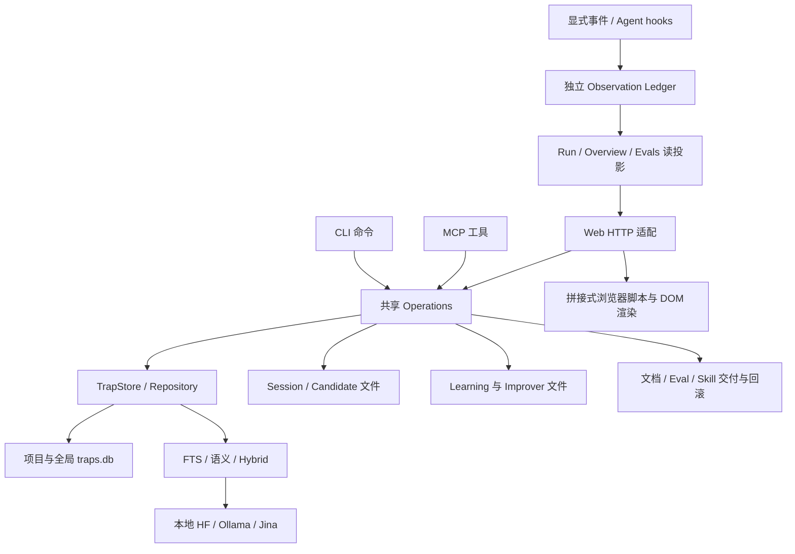

**Codetrap 全面分析：产品定位、前后端、观测反馈与 Tangle 借鉴**

审查日期：2026-09-04，美国太平洋时间。源码基线：`8b1c065`；工作区开始和结束时均无受版本控制文件的改动。本报告是分析与实施建议，没有修改产品代码、启用观测、确认经验或安装 Skill。

**1. 核心判断：值得继续投入，需要分阶段重构，优先补实证闭环。**

Codetrap 已经具备“经验资产系统”的多数底层能力：跨会话来源、结构化经验、候选审核、中文与混合检索、个人学习材料、可回滚的 Skill 改进、事件账本、离线评估。其问题是这些能力的连接和用户理解成本，特别是从“看到记录”到“知道下一步该怎样改善”。

目前不建议整体重写、改成微服务、替换 SQLite、引入向量数据库，或先做一个通用 Agent 工作流画布。建议保留 Bun + TypeScript + SQLite 的本地单体，重构浏览器模块，修好观测身份和评测语义，补上从实际使用到经验更新的最短路径。

你这次给出的定位是“AI 时代帮助个人成长的百宝箱”。它与旧设计中的“远程协作团队优先”存在优先级冲突。应以这次的个人定位安排后续路线，把 Team Hub 等工作后移。旧决定见 [Impact 设计第 46 行](/Users/superstorm/Documents/Code/windsurf/codetrap/docs/impact-evals-design.zh-CN.md:46)。

**2. 审查覆盖与验证边界。**

盘点了 `src` 的 133 个生产 TypeScript 文件、约 40,248 行，以及 74 个测试文件、约 17,023 行；重点阅读了检索、存储、候选生命周期、历史学习、Learning Impact、Improver、Skill 交付、Observation Ledger、Evals 和 Web。文件盘点不等于逐行形式化审计。

| 验证 | 结果 | 可以支持的结论 |
|---|---|---|
| `bun run typecheck` | 通过 | 当前 TypeScript 编译检查通过；模板字符串内浏览器代码仍不完整受类型约束 |
| 74 个测试文件分别运行 | 合计 542 通过、1 失败、0 跳过；73 个文件通过 | 大部分既有行为有测试保障，不能宣称全绿 |
| 观测、反馈、Learning Impact、受治理评估和受控评估的 9 个文件 | 66 通过、0 失败 | 这些既有合同的测试通过；不覆盖本次新发现的身份与负例问题 |
| `benchmark:retrieval -- --verify` | 通过 | 公布的合成检索基线没有漂移 |
| 原始 `bun test src/tests` 单进程 | 浏览器断言失败，之后进程退出 137，未产生完整汇总 | 原命令未通过；退出原因未诊断，不能直接归因为内存泄漏 |
| 本地实际 Web | 检查 Overview、引导、示例 Run、Evals、Learning 空态 | 当前页面可访问；项目未开启观测，不能验证真实历史轨迹价值 |
| 隔离 Learning 界面 | 标记 Learned 成功，刷新后保留 | 未复现学习状态无法保存；测试即刻读取旧状态的时序问题更符合证据 |
| 两个一次性复现程序 | 身份碰撞和负例评测问题均复现 | 是可验证的问题，不只是架构偏好 |

首次类型检查因本地未安装 `tsc` 失败；按现有 lockfile 使用 `bun install --frozen-lockfile --ignore-scripts` 补齐依赖后通过。没有升级依赖版本。测试执行使用本机 Bun 1.3.13；仓库 CI 指定 1.3.14，本次没有运行远程 CI。

测试日志已复制到本报告旁的 `verification/` 目录。实际用户项目没有 `observations/ledger.sqlite`，Codex、Claude 的项目观测集成均为 disabled。这个结论只针对当前工作目录，不代表用户其他机器或项目。

**3. 产品定位应从“收藏经验”进一步走向“经验可使用、可修正、可证明价值”。**

建议用一句话定义产品：**把个人经历转成有出处、可修正、能供人学习和供 AI 使用的经验资产。**

“百宝箱”可以容纳多种载体，但用户进入产品时应该有一条清楚主线：遇到问题 → 留下经验 → 判断适用范围 → 下次及时使用 → 看结果 → 修正或淘汰。AI 变强以后，通用知识更容易获得，个人真正值得保留的是目标、约束、判断理由、适用条件、反例、验证结果和偏好，而不只是当时的错误描述。

当前设计已经把 Learning 与 Agent Library 分开，值得保留。一条来源可以同时产生适合人阅读的解释和适合 Agent 调用的行动卡；共享出处和版本关联即可，不需要把两个产品合并成同一种长文本。

| 个人需要 | 已有能力 | 建议补齐 |
|---|---|---|
| 记录经历 | Session、历史 review、候选 Inbox | Web 中直接“记录一次经验 / 导入一个来源”的入口和明确交接状态 |
| 理解与学习 | Insight、来源集合、顺序、内容反馈 | 解释自己的理解、练习、实际应用记录；先做轻量验证，不必立刻做复杂学习平台 |
| 交给 AI 使用 | confirmed trap、CLI/MCP、上下文包 | 经验身份与版本稳定关联，清楚展示适用和不适用条件 |
| 看经验是否有用 | helpful、miss、validation 等事件 | 把曝光、采用、帮助和任务结果分开；在相关任务里低成本给反馈 |
| 修正经验 | 编辑、替代、归档、验证、Skill 回滚 | 从反馈问题直接进入可审核修订，并看修订后的回归结果 |
| 看到成长 | Learned 状态和使用统计 | 以独立应用与减少重复错误为证据；收藏数量或点击 Learned 不能代表掌握 |

目前 [Learning 转候选](/Users/superstorm/Documents/Code/windsurf/codetrap/src/lib/learning-impact.ts:283) 固定生成 `pitfall_trap`，并使用通用“未遵守该 Insight 会造成问题”的草稿。对正向方法、决策原则、工作习惯，这种格式可能制造生硬的“错误”。已有 candidate kinds 能承载 convention、docs、insight、skill；先让这个转化入口支持恰当目标，不需要新造万能知识模型。

对早期个人产品，建议观察“这一周有多少经过确认的经验，在后续任务中被明确认为有帮助”，并同时展示参与任务数、有效反馈覆盖率、噪声和误导数量。它是用户反馈指标，不应包装成因果收益或一个综合成长分。

**4. 当前前后端结构。**

**值得保留的工程基础：** CLI/MCP/Web 复用操作语义；项目与全局 scope；独立、追加式 Observation Ledger；证据类别和隐私 allowlist；候选内容哈希、版本与授权绑定；精确预览和回滚；Embedding 失效与降级诊断；跨平台测试和公开基线。这些已经承担实际复杂性，重写时非常容易丢失。

**前端应优先重构。** [client-script.ts](/Users/superstorm/Documents/Code/windsurf/codetrap/src/web/client-script.ts:1) 有 3,255 行，通过模板字符串输出浏览器代码；[client-impact.ts](/Users/superstorm/Documents/Code/windsurf/codetrap/src/web/client-impact.ts:1) 有 1,307 行，依赖 `declare const state: any` 与共享全局函数，最后 [通过 `fn.toString()` 拼回脚本](/Users/superstorm/Documents/Code/windsurf/codetrap/src/web/client-impact.ts:1305)。HTML/CSS shell 又有 2,908 行。现状会增加改字段、跟踪异步状态、刷新草稿和调试打包差异的成本。

先将浏览器端改为正常 TypeScript 入口，按 Review、Library、Learning、Impact、Settings 拆功能目录，定义实际 API 返回类型、页面状态和请求生命周期。使用现有 Bun 构建资源并嵌入单文件发行，继续保留 CLI 与可执行文件分发。此步不必强制引入 React。若后续确认要做复杂的关联图、多面板交互和状态复用，再逐页采用 React；避免同时迁移所有界面、状态库和后端。

**后端需要局部整理。** 目前核心不是“框架太落后”，而是 `src/lib` 混合了经验、学习、候选、交付、观测和评估，`phase2`/`phase3` 的阶段名又进入持久化与命令语义。可以逐步按这些实际职责组织目录，对外使用用户能理解的名称，保留旧 CLI 别名和文件兼容读取。不同交付目标的授权、预览和回滚确实不同，不宜为减少文件数把它们压成万能 apply 函数。

**5. 需要优先处理的具体问题。**

| 编号与优先级 | 问题 | 影响与证据 | 建议 |
|---|---|---|---|
| F1 / P1 | 观测中的经验身份没有稳定区分 scope | 同一 Run 的 project #1 和 global #1 的反馈被合并；第二条覆盖第一条 | 引入显式 scoped experience ref，携带 scope/store 身份、ID 和 revision；贯穿事件、聚合、候选、详情链接 |
| F2 / P1 | 负例没有“错误推荐必须失败”的评测门槛 | `no_relevant_trap` 返回错误经验仍 passed=true | 加入 no-hit / forbidden IDs / 噪声约束，分别报告召回与错误推荐 |
| F3 / P2 | Overview 和 Evals 的 helpful 口径不同 | Overview 累加历史反馈；Evals 保留当前评价 | 当前效果指标使用相同折叠逻辑，历史修改次数单独标注 |
| F4 / P1 产品 | 观测、Improver 和经验修订没有统一入口 | 观测主要变为检索 fixture；Improver 依赖另一套结构化反馈输入 | 建立“反馈 → 问题 → 草稿 → 评测 → 审核 → 修订”的可追溯路径 |
| F5 / P2 | Evals 与被使用项目的源码测试目录耦合 | 多处固定 `src/tests/fixtures/search-eval.json`，校准只能选择其中的 trap | 产品默认存 `.codetrap/evals/`；显式导出到源码测试；维护身份映射与语料快照 |
| F6 / P2 | 页面刷新重复做大量工作 | 5 秒刷新时重算全事件投影、Run 查询、fixture 评估和候选关联 | 先加游标/时间范围、批量加载、按证据与配置版本缓存；有测量依据后再做增量投影 |
| F7 / P2 | 运行结束与业务成功含义容易混淆 | Hook 的 Stop 写 completed/complete，但没有验证或采用证据 | 将采集完成、执行结束、验证结果和用户成功判断分开展示 |
| F8 / P2 | 浏览器类型和测试保护不足 | 1 个 smoke 失败，部分测试验证字符串存在而非完整交互 | 修等待条件；补少量关键用户流程测试；编译真实浏览器模块 |
| F9 / P2 产品 | 学习与观测入口暴露实现术语 | 当前空态出现 Phase 2、fixture、ledger 和长 Agent 指令 | 用用户目标命名主入口，工程细节放到可展开区 |

F1 的直接来源是 [exposureRatingKey](/Users/superstorm/Documents/Code/windsurf/codetrap/src/lib/observation-ledger.ts:557)，只使用 Run ID 与数字 trap ID。虽然 [搜索记录](/Users/superstorm/Documents/Code/windsurf/codetrap/src/lib/trap-operations.ts:85) 把 scope 放进 revision 字符串，聚合没有使用它。[网页投影](/Users/superstorm/Documents/Code/windsurf/codetrap/src/web/observation-view.ts:190) 也只留下数字 ID，[页面跳转](/Users/superstorm/Documents/Code/windsurf/codetrap/src/web/client-impact.ts:1190) 通过当前列表或 project-first 猜测 scope，因此也可能打开错误经验。

一次性复现结果：project #1 标 helpful、global #1 标 harmful，预期两条被评价经验，实际 `rated_exposures=1`、`superseded_feedback=1`、helpful=0。见 [复现脚本](/Users/superstorm/.codex/visualizations/2026/09/05/01a06f12-717a-7352-9e52-ea6e306e4141/observation-repro.ts) 与 `verification/observation-repro.jsonl`。同一经验从 helpful 改 harmful 时，Overview 仍显示 helpful=1、harmful=1，Evals 则 helpful=0、harmful=1；后者说明 F3 的口径差异，不代表历史事件应该被删除。

F2 的根源是 [caseReport](/Users/superstorm/Documents/Code/windsurf/codetrap/src/lib/search-eval.ts:341) 只比较 Recall 门槛，而 [空 gold 集合](/Users/superstorm/Documents/Code/windsurf/codetrap/src/lib/search-eval.ts:382) 不论实际结果都返回 Recall=1。复现中“CSS animation timeout”在仅含 HTTP timeout 经验的语料上返回 #1，但人工标定的 `no_relevant_trap` 仍通过。见 [复现脚本](/Users/superstorm/.codex/visualizations/2026/09/05/01a06f12-717a-7352-9e52-ea6e306e4141/negative-eval-repro.ts)。这会削弱由“错误推荐”反馈推动优化的能力。

F5 的固定路径见 [governed-eval-operations.ts](/Users/superstorm/Documents/Code/windsurf/codetrap/src/lib/governed-eval-operations.ts:23)、[evals-view.ts](/Users/superstorm/Documents/Code/windsurf/codetrap/src/web/evals-view.ts:23)、[controlled-eval.ts](/Users/superstorm/Documents/Code/windsurf/codetrap/src/lib/controlled-eval.ts:19)。`fixtureTraps()` 的 ID 是 fixture 数组下标 + 1，并非项目/全局线上经验的稳定 ID。人工转换目前是有意流程；但面向任意个人项目推广前，需要明确“真实经验 → 快照用例”的桥接，避免把 Codetrap 仓库的自测目录当成所有项目的产品存储约定。

F6 属于源码可见的规模风险，本次没有对大型真实账本做延迟压测，不能声称现在已经很慢。[overview/Run 查询](/Users/superstorm/Documents/Code/windsurf/codetrap/src/lib/observation-ledger.ts:223) 会全量读事件或逐 Run 读；[校准状态关联](/Users/superstorm/Documents/Code/windsurf/codetrap/src/lib/governed-eval-operations.ts:296) 对每个候选重新扫描全部 session candidates；[Evals GET](/Users/superstorm/Documents/Code/windsurf/codetrap/src/web/evals-view.ts:94) 每次重新跑 fixture；[浏览器刷新](/Users/superstorm/Documents/Code/windsurf/codetrap/src/web/client-script.ts:3010) 每 5 秒重复加载。另需为临时 eval 数据库补充明确资源关闭；当前 [evaluateSearchFixtureCases](/Users/superstorm/Documents/Code/windsurf/codetrap/src/lib/search-eval.ts:153) 没有对应的 finally/dispose。它是值得检查的生命周期问题，但不能据此断定原测试进程为何退出 137。

F8 的失败位置是 [点击后立即读取 `.active` 文本](/Users/superstorm/Documents/Code/windsurf/codetrap/src/tests/web-browser-smoke.test.ts:109)。实际 [状态更新](/Users/superstorm/Documents/Code/windsurf/codetrap/src/web/client-script.ts:1782) 要等待 HTTP 请求后才替换页面数据；测试的 `expectText` 是即时读取，并不自动重试。隔离界面通过 CUA 点击并刷新后保持 Learned，因此建议先等待明确 UI 后置条件，再判断产品缺陷，不要通过删断言让测试变绿。

**6. 观测现在能否反馈优化 Codetrap？可以，但主要是人工驱动的检索改进闭环。**

| 路径 | 现状 | 限制 |
|---|---|---|
| search → exposure → validation / feedback → Evals | 已有 | validation 与人类反馈需要显式记录；hooks 本身只覆盖任务开始结束 |
| 不相关 / 有害 / 漏召回 / 曝光后失败 → 候选问题 | 已有 | 是复查线索，不是因果归因和真值 |
| 候选问题 → 人工补 query 和期待 → fixture | 已有，可预览、审核、拒绝和回滚 | 依赖 fixture corpus，负例门槛需要加强 |
| fixture → baseline/candidate 比较 | 已有 | 是确定性检索对照，没有实际执行 Agent 任务 |
| 结构化反馈 → Improver → trap/docs/eval/skill 草稿 | 已有另一条路径 | 需要调用者提交 lesson 和相关内容，未自动消费 Observation Ledger |
| 人为修订经验 → 后续真实任务效果对比 | 部分元数据基础 | 缺少完整的版本、采用与任务结果关联及受控 Agent 实验 |
| 观测自动调参、自动更新所有经验或 Skill | 未实现 | 不建议直接跳到这一阶段 |

[Improver.capture/run](/Users/superstorm/Documents/Code/windsurf/codetrap/src/lib/improver-operations.ts:73) 读取自己的反馈文件和结构化 lesson；没有直接读取 Observation Ledger。[rank signals](/Users/superstorm/Documents/Code/windsurf/codetrap/src/lib/search-policy.ts:271) 基于标题、tag、标识符、严重度、适用范围、时效等信号，没有消费观测 helpful/harmful 的自动更新策略。`useful` 会更新计数并可记录反馈，但不是一次评分就自动重训或改排序。

还有一层“类型已设计但未贯通”：`candidate/status-changed` 和 `eval/experiment-completed` 出现在事件 schema 与显示分支中，但本次源码检索未找到候选接受或 ControlledEval 完成时对应的生产事件写入。ControlledEval 当前持久化结果文件。因此存在内容/状态文件可以查询，不等于账本中已经有完整的经验演化轨迹。

**7. 当前评测不能回答的事情。**

Evals 页面本地显示的 24 条用例 Recall@3、Recall@5、MRR 均为 100%。它跑的是 checked-in fixture，并由 [EvalEmbedder](/Users/superstorm/Documents/Code/windsurf/codetrap/src/lib/search-eval.ts:99) 提供 14 维确定性向量，不是用户所选 Hugging Face 或 Ollama 模型的真实检索表现。

[memory_contribution_v1](/Users/superstorm/Documents/Code/windsurf/codetrap/src/lib/controlled-eval.ts:453) 的 baseline 将已知 gold traps 替换成中性占位，再与保留它们的一侧比较。它能验证“提供该记忆后可检索到它”这类机制，却不能测量 Agent 最终代码是否更好、用户是否少走弯路。重复确定性试验主要验证可复现性和运行时间，不会自动产生更多独立效果样本。

公开 benchmark 另有合成语料和 category proxy，本次 verify 通过；其代码也明确声明 real embedding quality、candidate quality、behavior change 均未测量。见 [benchmark 说明](/Users/superstorm/Documents/Code/windsurf/codetrap/benchmarks/retrieval-v1/README.md)。

建议按顺序扩展验证：真实来源的正例与负例 → 真实嵌入模型在同一 frozen corpus 上的 holdout → 经验修订前后的检索与噪声对照 → 少量相同任务、相同模型/版本、相同资源预算的有/无记忆或旧/新记忆 Agent 实验。最后一步需独立的执行许可、预算和隔离方案，本次没有执行。

**8. 页面实际审查：当前最大短板是入口与行动路径。**

主流程四步如下。截图采于本次审查、1440×900 的桌面视口。Run 图明确来自产品内置浏览器示例；其余截图反映当前可见数据。Learning 的“all projects”仅表示 Web 已登记项目，不是扫描整台机器。

1. **Overview：页面工作正常，首次启用门槛偏高。** 明确区分示例与真实记录是优点；但左右区域同时解释“没有数据”，当前项目名称又藏在折叠入口。主要按钮是看示例，真实接入需要展开说明再把命令交给 Agent。建议优先展示当前项目、客户端、最近收到事件时间、接入检查与下一步，保持主动启用且让预览内容就地可见。

2. **Run 时间线：结构可用，行动能力不足。** 已有时间刻度、过滤、折叠事件和经验跳转，不需要重新发明 timeline。现在展示 #ID、耗时、状态和计数，难直接解释“这条经验为何出现、是否采用、怎样修正”。应在展开的经验事件里显示正确的 scope、标题、版本、召回原因与反馈操作，详情面板给“有帮助 / 不相关 / 有误 / 本该提醒”及修订入口。先修好身份再加可视化。

3. **Evals：证据分类认真，日常使用的优先级需要调整。** 当前最醒目的是四类说明与 100% 离线指标，真实观测尚未启用的信息在下面。建议首先展示需要处理的问题、真实反馈的覆盖程度与观测缺口；离线质量和对照试验作为可进入的专门视图。不要让低样本、自测满分成为普通用户判断成效的主要视觉信号。

4. **Learning：已有学习状态能力，但首次沉淀路径薄弱。** 当前空态把 Phase 2 和一段长 Agent 指令交给用户，没有直接完成首次导入的轻量流程。建议提供“保存一个来源 / 写下这次经验 / 从当前任务提炼”，进入同一个可审核草稿。详细的覆盖核对、脱敏和目标路由仍可保留在后续步骤。

可访问性观察：页面使用了语义化按钮、tab group、可折叠事件和 splitter 标签，这些值得保留。技术编号、较小的辅助字和窄时间标记仍有辨认与操作风险；缺失正文/诊断导致的可理解性不是放大字号能解决的。本次检查了默认窄视口和桌面布局，未完成屏幕阅读器、200% 缩放、完整键盘路径或对比度标准测试，不声称 WCAG 合规或不合规。

**9. Tangle 的思想和结构有帮助；最直接的参考还包括 tangle-ui。**

Tangle 是容器化 ML/批处理 pipeline 的编辑与执行系统，包含运行、步骤、产物、缓存与复现能力。你给出的仓库主要是后端，界面实现在 [tangle-ui](https://github.com/TangleML/tangle-ui)。本次阅读了后端 `ac5599bd` 和前端 `c75eec18`，没有安装或运行其云计算任务。[Tangle 官方项目介绍](https://github.com/TangleML/tangle)

| 可借鉴的设计 | Tangle 中的依据 | 在 Codetrap 中的用途 |
|---|---|---|
| Run、执行节点、数据产物分别建模 | PipelineRun、ExecutionNode、ArtifactData/ArtifactNode 与输入输出关系 | 让经验版本、评测报告和修订成为能追溯的资产，而不是孤立的事件文字 |
| 点选步骤后看对应详情 | RunViewFlowCanvas、节点选择和详情上下文 | 时间线/关联图选一条经验，侧栏展示准确版本、证据与改进操作 |
| 比较两个运行 | CompareView 中的 metadata、task、artifact、log 对比 | 对比旧经验/新经验、旧检索策略/新策略，优先显示回归和变动 |
| 定义信息与动态运行状态分开请求 | usePipelineRunData 的查询与完成后停止轮询 | 缓存稳定的版本/配置，只刷新有变化的任务状态和事件 |
| API 与长任务执行职责分开 | 后端 API Server / Orchestrator 设计 | 将来真正执行 Agent 对照或长时嵌入任务时，增加本地 worker/job 边界 |

数据关系依据：[Tangle 后端模型](https://github.com/TangleML/tangle/blob/ac5599bdca7111ef89563abdd2328a7eb49452cb/cloud_pipelines_backend/backend_types_sql.py)。交互依据：[RunViewFlowCanvas](https://github.com/TangleML/tangle-ui/blob/c75eec185faa92935066ce15be80b8c824e05fd6/src/routes/v2/pages/RunView/components/RunViewFlowCanvas.tsx)、[RunMetadataSection](https://github.com/TangleML/tangle-ui/blob/c75eec185faa92935066ce15be80b8c824e05fd6/src/routes/v2/pages/CompareView/components/RunMetadataSection.tsx)、[usePipelineRunData](https://github.com/TangleML/tangle-ui/blob/c75eec185faa92935066ce15be80b8c824e05fd6/src/hooks/usePipelineRunData.ts)。表格第三列是本报告对 Codetrap 的适用性推断，不是 Tangle 已提供的 Codetrap 功能。

最适合先做的图是**经验来历与使用关系图**：来源 → 人工确认的经验版本 → 哪次 Run 曝光 → 采用或反馈 → 修订候选 → 评测对比 → 下一个版本。每条连接都来自明确的关系字段。已有事件只有时间顺序时，只画时间线，不画成“前一步导致后一步成功”的因果图。

这张图是目标设计，含尚未贯通的采用、修订、发布与后续验证关系。不要将它描述成现有完整实现。对普通串行任务，现有时间线比全屏 DAG 更易读；只有真实并行分支、子任务和跨资产关系足够多时，再引入可缩放图。React Flow 可以作为届时的实现选项，Tangle 当前运行画布使用它；无需照搬其全部依赖、云 launcher、多租户和复杂窗口状态。

**10. 重构与升级的建议顺序。**

| 阶段 | 具体交付 | 验收方式 |
|---|---|---|
| A：让数字可信 | 修 scoped identity、反馈口径、负例/noise 门槛；修 smoke 等待 | 本报告两个复现变成回归测试；跨 scope 跳转正确；原测试命令可给完整结果 |
| B：打通最短反馈路径 | Run 内轻量反馈；问题可转经验修订或 Eval；显示版本与审核状态 | 一条不相关反馈能产生可预览修订，确认后复测并能回滚 |
| C：降低前端维护成本 | 真实 TS 浏览器入口、按功能拆分、typed API、稳定查询与草稿状态 | Review/Learning/Impact 行为、刷新恢复和发行二进制都保留 |
| D：让观测适合个人日常使用 | 可见的项目与连接状态、待办优先总览、证据详情、受限范围查询 | 新项目可完成首次接入和第一条真实反馈；数据未采集时明确显示未知 |
| E：验证“帮助成长” | 真实样本、反例、真实嵌入 holdout、小规模实际任务对照、实践记录 | 以显式用户反馈和可验证任务结果评估，避免用合成检索满分代替价值 |
| F：按使用量扩展 | 增量投影、个人跨项目资产视图、Tangle 式关系和版本对比 | 有真实数据和使用需求后逐步加入，不提前迁移所有存储 |

技术版本方面，当前主要依赖已包含较新的 TypeScript 和 Transformers；没有证据支持仅为“升级”整体换栈。更需要收紧 package 声明与实际测试的 Bun 版本范围，保持 embedding 下载/推理/缓存边界，处理预发布 ONNX runtime 的兼容验证，并补真实模型质量与大数据读路径的基线。这些是兼容与效果验证工作，不等于所有预发布依赖都必须立刻替换。

预计收益最大的第一批工作是 **A + B 的一个完整切片**：选一条用户能明确评价的经验，做到正确归因、反馈、修订、反例验证、批准与后续回看。它比新增更多观测卡片更能验证 Codetrap 是否在向个人百宝箱的目标前进。
